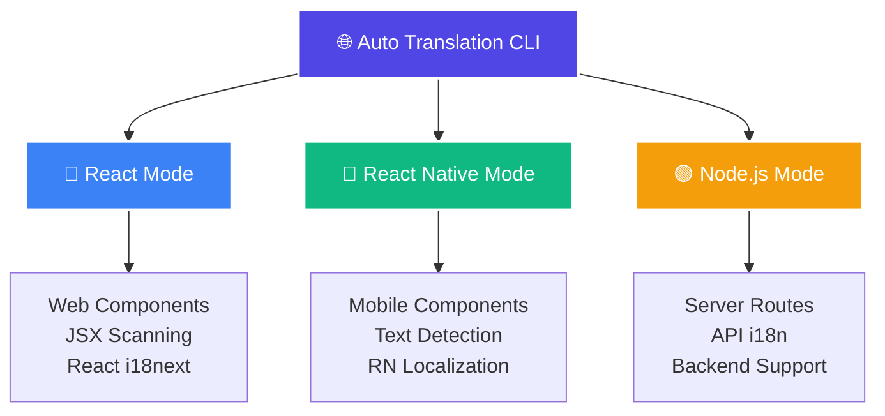

# 🌐 Auto Translation CLI - Now with React Native Support!

<div align="center">


[](https://www.npmjs.com/package/auto-translation)
[](https://www.npmjs.com/package/auto-translation)
[](https://opensource.org/licenses/MIT)
[](https://github.com/asadrafi1221/auto_translate_npm_package/stargazers)

**A powerful CLI tool for automating internationalization (i18n) in React & React Native projects**

*Streamline your translation workflow with intelligent text extraction, automated wrapping, and seamless i18n setup*

[🚀 Quick Start](#-quick-start) • [📖 Documentation](#-available-commands) • [🎯 Examples](#-usage-examples) • [🤝 Contributing](#-contributing)

</div>

---

## 🚨 **MAJOR UPDATE ALERT!** 

<div align="center">

### 📱 **React Native Support is Here!** 


</div>

> ### 🔥 **Using the previous version?** Update now to unlock React Native support and enhanced multi-file structure capabilities!
> 
> ```bash
> npm update -g auto-translation
> # Now supports both React & React Native with advanced file organization!
> ```

<div align="center">

### 📱 **Perfect for React Native Apps!** 
*Mobile app developers can now automate their i18n workflow with zero hassle*


</div>

---

## ✨ **Features That Make You Go WOW!**

<div align="center">


</div>

| 🚀 **Lightning Fast** | 📱 **Universal Support** | 🎯 **Smart Workflows** | 🛡️ **Enterprise Ready** |
|:---------------------:|:------------------------:|:-----------------------:|:------------------------:|
| One-command setup | ✅ React Apps | Mode-based configs | Configuration tracking |
| Zero configuration | ✅ React Native | Strict mode protection | Version control friendly |
| Smart dependency mgmt | 🔜 Node.js Backend | Team collaboration | Scalable architecture |

<details>
<summary><b>🔍 Click to see detailed features</b></summary>

### 🧠 **Intelligent Detection Engine** 
- Context-aware text scanning
- JSX/TSX component analysis
- React Native Text component detection
- Multi-file structure support (`const en = {...agents}`)

### 🔄 **Automatic Transformation Magic**
- Plain text → `t()` conversion
- Smart key generation
- Namespace organization
- Multi-language file creation

### 🎨 **Advanced File Organization**
- Feature-based translation files
- Nested namespace support
- Clean folder structures
- Resource bundling

</details>

---

## 🏗️ **Multi-Platform Architecture**

<div align="center">



</div>

---

## 📦 **Installation**

<div align="center">


### 💫 **Choose Your Installation Method**

</div>

```bash
# 🌟 Install globally (Recommended)
npm install -g auto-translation

# 🚀 Use directly with npx
npx auto-translation

# 📦 Install as dev dependency
npm install --save-dev auto-translation
```

<div align="center">

### 🔗 **Quick Access Links**

[](https://www.npmjs.com/package/auto-translation)
[](https://github.com/asadrafi1221/auto_translate_npm_package)
[](mailto:asadradi1221@gmail.com)

</div>

---

## 🚀 **Quick Start Guide**

### **Step 1: Initialize Your Project** 🎯

<div align="center">


</div>

```bash
npx auto-translation
```

**Interactive Mode Selection:**
- 🔵 **React** - For web applications
- 📱 **React Native** - For mobile apps
- 🟢 **Node.js** - Coming soon!

### **Step 2: Complete i18n Setup** ⚡

<div align="center">


</div>

```bash
npx auto-translation init
```

**🎯 What happens during init:**

<table>
<tr>
<th width="50%">⚛️ React Mode</th>
<th width="50%">📱 React Native Mode</th>
</tr>
<tr>
<td>

- ✅ Installs `react-i18next` & `i18next`
- 🏗️ Creates `src/i18n` structure
- 📝 Generates `index.js` config
- 🔧 Sets up namespace files
- 🎨 Multi-file support ready

</td>
<td>

- ✅ Installs `react-native-localization`
- 🏗️ Creates `src/i18n` structure  
- 📝 Generates RN-specific config
- 🔧 Sets up screen/component files
- 📱 Mobile-optimized setup

</td>
</tr>
</table>

### **Step 3: Scan & Extract Keys** 🔍

<div align="center">


</div>

```bash
npx auto-translation scan
```

**🎯 Interactive File Selection Process:**
1. 📂 Choose directories or specific files
2. 🔍 Smart detection of translatable content
3. 📝 Automatic key extraction
4. 🎨 Multi-namespace organization

### **Step 4: Auto-wrap Plain Text** 🪄

<div align="center">


</div>

```bash
npx auto-translation wrap
```

**🔄 Before & After Examples:**

<table>
<tr>
<th>❌ Before</th>
<th>✅ After</th>
</tr>
<tr>
<td>

**React:**
```jsx
function WelcomeScreen() {
  return (
    <div>
      <h1>Welcome to our app</h1>
      <p>Sign in to continue</p>
      <button>Get Started</button>
    </div>
  );
}
```

**React Native:**
```jsx
function WelcomeScreen() {
  return (
    <View>
      <Text>Welcome to our app</Text>
      <Text>Sign in to continue</Text>
      <TouchableOpacity>
        <Text>Get Started</Text>
      </TouchableOpacity>
    </View>
  );
}
```

</td>
<td>

**React:**
```jsx
function WelcomeScreen() {
  const { t } = useTranslation();
  return (
    <div>
      <h1>{t('welcome_to_our_app')}</h1>
      <p>{t('sign_in_to_continue')}</p>
      <button>{t('get_started')}</button>
    </div>
  );
}
```

**React Native:**
```jsx
function WelcomeScreen() {
  const { t } = useTranslation();
  return (
    <View>
      <Text>{t('welcome_to_our_app')}</Text>
      <Text>{t('sign_in_to_continue')}</Text>
      <TouchableOpacity>
        <Text>{t('get_started')}</Text>
      </TouchableOpacity>
    </View>
  );
}
```

</td>
</tr>
</table>

---

## 📋 **Complete Command Reference**

<div align="center">


### 🎯 **Core Commands** (Auto-prefixed by mode)

</div>

| Command | React Mode | React Native Mode | Description | Status |
|---------|:----------:|:-----------------:|-------------|:------:|
| `init` | `react-init` | `rn-init` | Complete i18n setup with dependencies | ✅ |
| `scan` | `react-scan` | `rn-scan` | Scan and extract translation keys | ✅ |
| `wrap` | `react-wrap` | `rn-wrap` | Auto-wrap text with translation calls | ✅ |
| `file-update` | `react-file-update` | `rn-file-update` | Manage translation file structure | ✅ |
| `setup` | `react-setup` | `rn-setup` | Setup folder structure only | ✅ |
| `ignore-init` | `react-ignore-init` | `rn-ignore-init` | Initialize .ignoreKeys file | ✅ |

<div align="center">

### ⚙️ **Configuration & Management Commands**

</div>

| Command | Description | Example Usage |
|---------|-------------|---------------|
| `config` | 📊 Show current project configuration | `npx auto-translation config` |
| `reset-config` | 🔄 Reset configuration to defaults | `npx auto-translation reset-config` |
| `npx auto-translation` | 🎯 Interactive mode selection menu | Launch main menu |

---

## 🎯 **Smart Mode System**

<div align="center">


### 🧠 **Intelligent Command Prefixing**

</div>

The CLI automatically handles command prefixing based on your selected mode. You just use the clean commands!

<table>
<tr>
<th>🔵 React Mode</th>
<th>📱 React Native Mode</th>
<th>🟢 Node.js Mode</th>
</tr>
<tr>
<td>

```bash
# You type:
scan
init  
wrap

# CLI executes:
react-scan
react-init
react-wrap
```

</td>
<td>

```bash
# You type:
scan
init
wrap

# CLI executes:
rn-scan
rn-init
rn-wrap
```

</td>
<td>

```bash
# You type:
scan
init
wrap

# CLI executes:
node-scan
node-init
node-wrap
```
<div align="center">🔜 <em>Coming Soon</em></div>

</td>
</tr>
</table>

### 🔒 **Strict Mode Protection**

<div align="center">


</div>

Once you run mode-specific commands, the project enters **strict mode**:

- 🛡️ **Prevents** accidental cross-mode usage
- 🔐 **Locks** project to selected mode  
- 👥 **Ensures** team consistency
- ⚡ **Maintains** workflow integrity

**🔓 To unlock strict mode:**
```bash
npx auto-translation
# Select "🔓 Unlock strict mode" from the interactive menu
```

---

## 📁 **Generated Project Structures**

<div align="center">


</div>

### 🔵 **React Project Structure**

```
your-react-app/
├── 📁 src/
│   └── 📁 i18n/
│       ├── 📄 index.js              # Main i18n configuration
│       ├── 📁 locales/
│       │   ├── 📁 en/
│       │   │   ├── 📄 common.json   # Common translations
│       │   │   ├── 📄 agents.json   # Agent-specific terms  
│       │   │   ├── 📄 navigation.json
│       │   │   └── 📄 components.json
│       │   └── 📁 es/
│       │       ├── 📄 common.json
│       │       ├── 📄 agents.json
│       │       ├── 📄 navigation.json
│       │       └── 📄 components.json
│       └── 📄 resources.js          # Multi-file resource loader
├── 📄 .translate-package-config     # Project configuration  
└── 📄 .ignoreKeys                   # Ignored translation terms
```

### 📱 **React Native Project Structure**

```
your-rn-app/
├── 📁 src/
│   └── 📁 i18n/
│       ├── 📄 index.js              # RN i18n configuration
│       ├── 📁 locales/
│       │   ├── 📁 en/
│       │   │   ├── 📄 common.json
│       │   │   ├── 📄 screens.json  # Screen-specific translations
│       │   │   ├── 📄 components.json
│       │   │   └── 📄 navigation.json
│       │   └── 📁 es/
│       │       ├── 📄 common.json
│       │       ├── 📄 screens.json
│       │       ├── 📄 components.json
│       │       └── 📄 navigation.json
│       └── 📄 resources.js          # Native resource loader
├── 📄 .translate-package-config
└── 📄 .ignoreKeys
```

### 💡 **Enhanced Multi-File Structure Support**

**🚀 NEW:** Advanced support for organized translation files:

```javascript
// 📄 resources.js - Auto-generated multi-file loader
const en = {
  common: require('./locales/en/common.json'),
  agents: require('./locales/en/agents.json'),
  navigation: require('./locales/en/navigation.json'),
  screens: require('./locales/en/screens.json'),     // RN specific
  components: require('./locales/en/components.json'),
};

const es = {
  common: require('./locales/es/common.json'),
  agents: require('./locales/es/agents.json'),
  navigation: require('./locales/es/navigation.json'),
  screens: require('./locales/es/screens.json'),     // RN specific
  components: require('./locales/es/components.json'),
};

export { en, es };
```

---

## 🎮 **Interactive Workflows**

<div align="center">


</div>

### 📂 **Smart File Selection Interface**

When running `scan`, you get a powerful interactive file picker:

```bash
npx auto-translation scan
```

**🎯 Features:**
- ☑️ **Multi-select** files and directories
- 👀 **Preview** file content before processing
- ⏭️ **Skip** files that shouldn't be translated
- 📱 **React Native** component auto-detection
- ⚛️ **React** JSX/TSX intelligent scanning
- 🎨 **Syntax highlighting** for better visibility

### 🚫 **Ignore Keys Configuration**

<div align="center">


</div>

```bash
npx auto-translation ignore-init
```

**📝 Create `.ignoreKeys` file for:**
- 🏷️ **Brand names** and proper nouns
- 💻 **Technical terms** and code keywords
- 🎯 **Framework-specific** terminology (React/RN)
- 🔧 **API endpoints** and configuration keys
- 📦 **Package names** and imports

**Example `.ignoreKeys`:**
```
React
useState
useEffect
AsyncStorage
NavigationContainer
axios
localhost
```

---

## 💡 **Best Practices & Pro Workflows**

<div align="center">


</div>

### 🚀 **React Web App Setup**

```bash
# 1. 🎯 Initialize React mode
npx auto-translation
# Choose "🔵 React" mode

# 2. ⚡ Complete i18n setup  
npx auto-translation init

# 3. 📥 Import i18n in your App.js or index.js
import './i18n';

# 4. 🔍 Scan components for translatable content
npx auto-translation scan

# 5. 🪄 Auto-wrap any remaining plain text
npx auto-translation wrap
```

### 📱 **React Native Mobile App Setup**

```bash  
# 1. 📱 Initialize React Native mode
npx auto-translation
# Choose "📱 React Native" mode

# 2. ⚡ Complete RN i18n setup
npx auto-translation init

# 3. 📥 Import i18n in your App.js
import './src/i18n';

# 4. 🔍 Scan screens and components  
npx auto-translation scan
# Focus on Screen files and reusable components

# 5. 🪄 Auto-wrap Text components
npx auto-translation wrap
```

### 👥 **Team Collaboration Workflow**

<div align="center">


</div>

<table>
<tr>
<td width="33%">

**📋 Version Control Setup**
```bash
# Add configuration files
git add .translate-package-config
git add .ignoreKeys
git add src/i18n/

# Commit i18n structure
git commit -m "🌐 Add i18n setup"
```

</td>
<td width="33%">

**🔒 Team Consistency**
```bash
# Verify project status
npx auto-translation config

# Ensure strict mode active
# Share .ignoreKeys with team
```

</td>
<td width="33%">

**🔄 Regular Maintenance**
```bash
# Weekly scan for new text
npx auto-translation scan

# Organize translation files
npx auto-translation file-update
```

</td>
</tr>
</table>

---

## 🎯 **Real-World Usage Examples**

<div align="center">


</div>

### 📱 **E-Commerce React Native App**

```bash
# 🛍️ Setup for shopping app
npx auto-translation
# Select "📱 React Native"

npx auto-translation init

# 🔍 Scan product screens
npx auto-translation scan
# Select: screens/ProductScreen.js, screens/CartScreen.js, components/ProductCard.js

# 📁 Result: Organized translation files
# - screens.json (product_title, add_to_cart, checkout)
# - components.json (price_label, rating_text)
# - navigation.json (home_tab, cart_tab, profile_tab)
```

### ⚛️ **SaaS Dashboard React App**

```bash
# 💼 Setup for business dashboard
npx auto-translation  
# Select "🔵 React"

npx auto-translation init

# 🔍 Scan dashboard components
npx auto-translation scan
# Select: components/Dashboard.js, components/Analytics.js, pages/

# 📊 Result: Feature-based organization
# - dashboard.json (welcome_message, total_sales, analytics)
# - common.json (save, cancel, delete, confirm)
# - navigation.json (dashboard, analytics, settings)
```

### 🎮 **Gaming React Native App**

```bash
# 🎮 Setup for mobile game
npx auto-translation
# Select "📱 React Native"

npx auto-translation init

# 🚫 Setup game-specific ignore terms
npx auto-translation ignore-init
# Add: Unity, Firebase, AsyncStorage, GameCenter

# 🔍 Scan game screens
npx auto-translation scan
# Select: screens/GameScreen.js, screens/LeaderboardScreen.js

# 🏆 Result: Game-ready i18n
# - screens.json (start_game, high_score, game_over)
# - common.json (play, pause, restart, quit)
```

---

## 🔧 **Advanced Configuration**

<div align="center">


</div>

### 📊 **Project Configuration File**

The `.translate-package-config` stores comprehensive project settings:

```json
{
  "mode": "react-native",
  "strictLocked": true,
  "multiFileSupport": true,
  "namespaces": [
    "common",
    "screens", 
    "components",
    "navigation",
    "agents"
  ],
  "supportedLanguages": ["en", "es", "fr", "de"],
  "defaultLanguage": "en",
  "createdAt": "2025-01-15T10:30:00.000Z",
  "lastModified": "2025-01-15T10:35:00.000Z",
  "version": "2.0.0",
  "author": "your-team-name"
}
```

### 🎯 **Custom Namespace Configuration**

```bash
# 📁 Create custom namespace structure
npx auto-translation file-update

# Example custom namespaces for different app types:

# 🏪 E-commerce App
# - products.json, cart.json, checkout.json, user.json

# 📱 Social Media App  
# - posts.json, comments.json, profile.json, messages.json

# 🎓 Educational App
# - lessons.json, quizzes.json, progress.json, achievements.json
```

---

## 🚧 **Roadmap - Exciting Updates Coming!**

<div align="center">


### 🌟 **What's Coming Next**

</div>

<table>
<tr>
<td width="33%" align="center">

**🟢 Node.js Mode**
<br/>

<br/>
✅ Backend route scanning<br/>
✅ API response i18n<br/>
✅ Server-side rendering<br/>
📅 **ETA: Q2 2025**

</td>
<td width="33%" align="center">

**🔧 Enhanced Tools**
<br/>

<br/>
✅ Translation validation<br/>
✅ Duplicate key detection<br/>
✅ Bulk file operations<br/>
📅 **ETA: Q2 2025**

</td>
<td width="33%" align="center">

**👥 Team Features**
<br/>

<br/>
✅ Team workspaces<br/>
✅ Translation reviews<br/>
✅ Progress tracking<br/>
📅 **ETA: Q3 2025**

</td>
</tr>
</table>

---

## 🤝 **Contributing**

<div align="center">


### 💻 **Join Our Growing Community!**

[](https://github.com/asadrafi1221/auto_translate_npm_package/graphs/contributors)

</div>

We love contributions! Here's how to get started:

<table>
<tr>
<td width="25%" align="center">

**🍴 Fork**
<br/>

<br/>
Fork the [repository](https://github.com/asadrafi1221/auto_translate_npm_package)

</td>
<td width="25%" align="center">

**🌿 Branch**
<br/>

<br/>
`git checkout -b amazing-feature`

</td>
<td width="25%" align="center">

**✨ Commit**
<br/>

<br/>
Clear, descriptive commits

</td>
<td width="25%" align="center">

**🚀 PR**
<br/>

<br/>
Submit your pull request

</td>
</tr>
</table>

### 🎯 **Areas We'd Love Help With:**

- 📱 **React Native** enhancements and optimizations
- 🎨 **UI/UX** improvements for CLI experience  
- 📖 **Documentation** improvements and examples
- 🐛 **Bug fixes** and performance optimizations
- 🧪 **Testing** coverage and automation
- 🌐 **Internationalization** of the CLI itself

---

## 📄 **License**

<div align="center">


This project is licensed under the **MIT License** - see the LICENSE file for details.

[](https://opensource.org/licenses/MIT)

</div>

---

## 🆘 **Support & Community**

<div align="center">


### 💬 **Get Help & Stay Connected**

</div>

<table>
<tr>
<td width="25%" align="center">

**🐛 Bug Reports**
<br/>

<br/>
[GitHub Issues](https://github.com/asadrafi1221/auto_translate_npm_package/issues)

</td>
<td width="25%" align="center">

**💬 Questions & Discussions**
<br/>

<br/>
[GitHub Discussions](https://github.com/asadrafi1221/auto_translate_npm_package/discussions)

</td>
<td width="25%" align="center">

**📧 Direct Support**
<br/>

<br/>
[asadradi1221@gmail.com](mailto:asadradi1221@gmail.com)

</td>
<td width="25%" align="center">

**📦 NPM Package**
<br/>

<br/>
[View on NPM](https://www.npmjs.com/package/auto-translation)

</td>
</tr>
</table>

<div align="center">

### 🌟 **Response Times**

| Support Channel | Average Response | Severity |
|:---------------:|:----------------:|:--------:|
| 🚨 **Critical Bugs** | Within 24 hours | High Priority |
| 🐛 **General Issues** | 2-3 business days | Medium Priority |
| 💬 **Questions** | 3-5 business days | Low Priority |
| 📧 **Direct Email** | 1-2 business days | Variable |

</div>

---

## 📈 **Usage Statistics & Community**

<div align="center">


### 📊 **Growing Fast!**


</div>

---

## 🔗 **Quick Access Links & Resources**

<div align="center">


### 🚀 **Essential Resources**

[](https://github.com/asadrafi1221/auto_translate_npm_package)
[](https://www.npmjs.com/package/auto-translation)
[](https://github.com/asadrafi1221/auto_translate_npm_package/wiki)
[](mailto:asadradi1221@gmail.com)

</div>

### 📚 **Additional Resources**

<table>
<tr>
<td width="50%">

**🎓 Learning Resources**
- [📖 React i18next Documentation](https://react.i18next.com/)
- [📱 React Native Localization Guide](https://reactnative.dev/docs/localization)
- [🌐 Internationalization Best Practices](https://developer.mozilla.org/en-US/docs/Web/JavaScript/Reference/Global_Objects/Intl)
- [⚛️ React Documentation](https://react.dev/)

</td>
<td width="50%">

**🛠️ Developer Tools**
- [🔍 Translation Key Analyzer](https://github.com/asadrafi1221/auto_translate_npm_package/tools/analyzer)
- [📊 Usage Statistics Dashboard](https://github.com/asadrafi1221/auto_translate_npm_package/stats)
- [🎯 Project Templates](https://github.com/asadrafi1221/auto_translate_npm_package/templates)
- [🤖 CLI Reference Guide](https://github.com/asadrafi1221/auto_translate_npm_package/docs/cli)

</td>
</tr>
</table>

---

## 💝 **Special Thanks**

<div align="center">


### 🙏 **Acknowledgments**

</div>

Special thanks to our amazing contributors and the open-source community:

- 🌟 **All our GitHub contributors** for their valuable contributions
- 📱 **React Native community** for feedback and testing
- ⚛️ **React community** for continuous support
- 🌐 **i18next team** for their excellent internationalization library
- 💻 **Node.js community** for the robust ecosystem

<div align="center">

### 🎉 **Join the Movement!**

*Help us make internationalization accessible to every developer*

[](https://star-history.com/#asadrafi1221/auto_translate_npm_package&Date)

</div>

---

<div align="center">

## 🌟 **Star us on GitHub if this tool helps you!** ⭐


### 🌍 **Making the world more connected, one translation at a time**

---

**🌐 Auto Translation CLI** | **v2.0.0+** | **⚛️ React & 📱 React Native Ready**


**💌 Built with love by [Asad Rafi](mailto:asadradi1221@gmail.com) and the amazing open-source community**

</div>